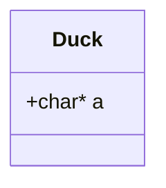

# This repo is made on subject: 6II0018 integrácia informačno-komunikačných systémov (iiks_aws)

Subject teaches AWS Cloudformation service. It is used to create infrastructure in AWS Cloude. It uses YAML or JSON languages. We use YAML.

